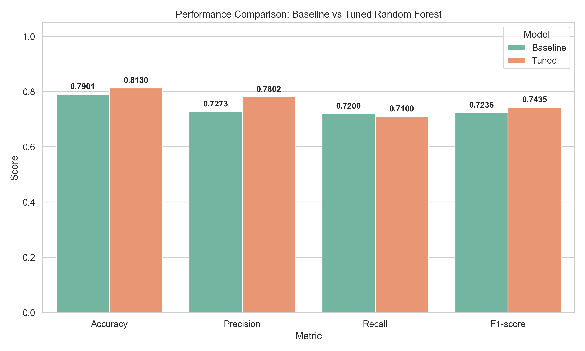
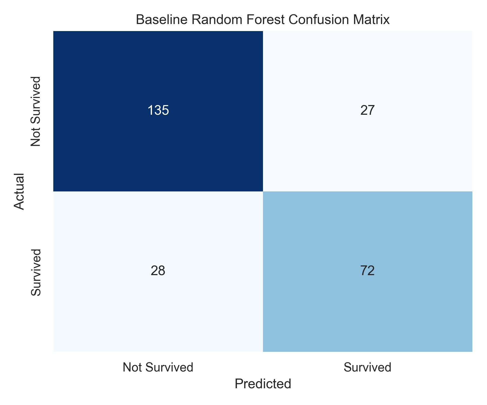
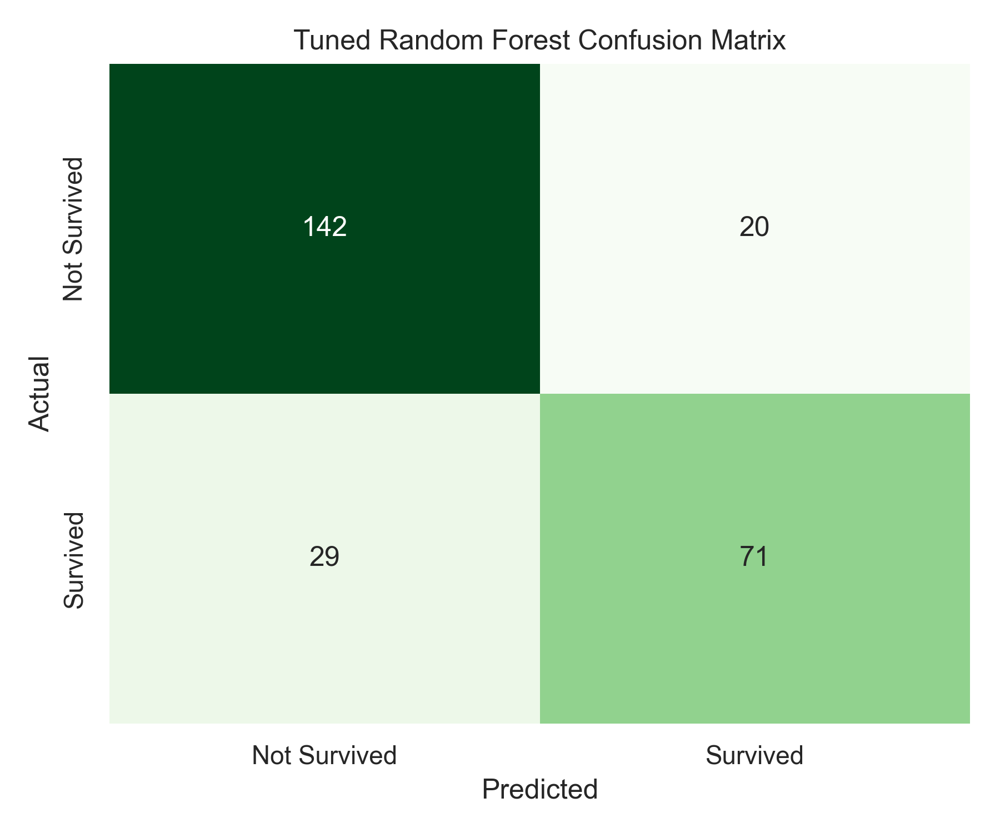
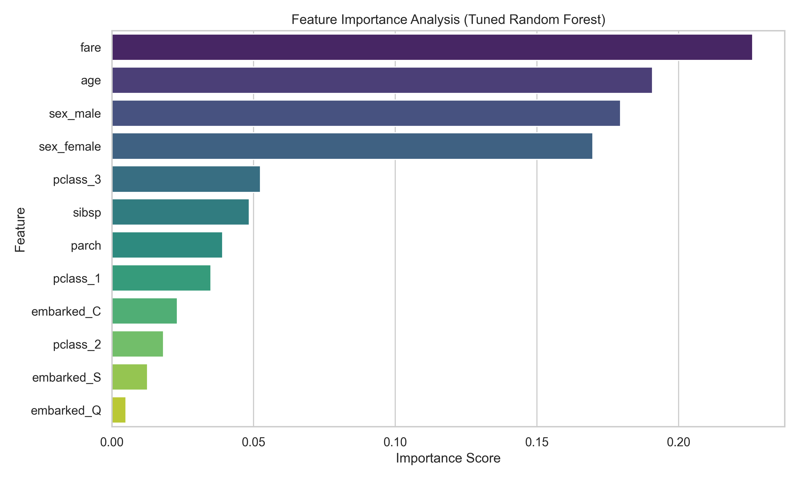

# Titanic Survival Prediction: End-to-End Random Forest Classification Pipeline

An end-to-end Machine Learning pipeline utilizing a **Random Forest Classifier** to predict passenger survival on the Titanic. The project features clean preprocessing pipelines, hyperparameter tuning with 5-fold cross-validation, feature importance analysis, and a modular enterprise-style design.

---

## 🎯 Objective
Develop, optimize, and evaluate a Random Forest binary classification pipeline to predict passenger survival on the Titanic, comparing a baseline default model against an optimized, hyperparameter-tuned model.

## 📝 Problem Statement
Given demographic and ticketing information about Titanic passengers, classify whether each passenger survived (`1`) or did not survive (`0`). This is a classic binary classification task, where we seek to build a model that generalizes well to unseen test data, minimizing both False Positives and False Negatives.

## 📊 Dataset Description
The dataset contains information about 1,309 passengers (combining train and test sets). The features include:

*   **`pclass`**: Passenger Class (1 = 1st, 2 = 2nd, 3 = 3rd class). A proxy for socio-economic status.
*   **`sex`**: Passenger gender (male or female).
*   **`age`**: Passenger age in years.
*   **`sibsp`**: Number of siblings / spouses aboard the Titanic.
*   **`parch`**: Number of parents / children aboard the Titanic.
*   **`fare`**: Passenger ticket fare.
*   **`embarked`**: Port of embarkation (C = Cherbourg, Q = Queenstown, S = Southampton).
*   **`survived` (Target)**: Binary survival status (0 = Deceased, 1 = Survived).

*Note: The pipeline loads the dataset dynamically from OpenML, falls back to a public GitHub repository CSV if offline, or generates a representative synthetic dataset as a final fallback.*

## 🛠️ Technologies Used
*   **Programming Language**: Python 3.10
*   **Data Manipulation**: Pandas, NumPy
*   **Machine Learning**: Scikit-Learn
*   **Visualization**: Matplotlib, Seaborn
*   **Model Serialization**: Joblib

---

## 📂 Project Structure
The repository is structured both for interactive analysis and modular, step-by-step pipeline execution:

```
├── .venv/                           # Python Virtual Environment
├── data/                            # Datasets & intermediate preprocessed numpy arrays
│   ├── titanic_raw.csv
│   ├── titanic_train.csv
│   ├── titanic_test.csv
│   ├── X_train_preprocessed.npy
│   ├── X_test_preprocessed.npy
│   ├── y_train.npy
│   └── y_test.npy
│
├── models/                          # Serialized preprocessors, models, and JSON metrics
│   ├── preprocessor.joblib
│   ├── tuned_model.joblib
│   ├── best_hyperparameters.json
│   ├── baseline_metrics.json
│   ├── tuned_metrics.json
│   └── feature_names.json
│
├── notebooks/                       # Interactive Jupyter Notebooks
│   └── random_forest_classification.ipynb
│
├── plots/                           # Generated visualization PNG files
│   ├── baseline_confusion_matrix.png
│   ├── tuned_confusion_matrix.png
│   ├── model_comparison.png
│   └── feature_importances.png
│
├── src/                             # Python source code
│   ├── 01_data_loading.py
│   ├── 02_train_test_split.py
│   ├── 03_preprocessing.py
│   ├── 04_baseline_model.py
│   ├── 05_hyperparameter_tuning.py
│   ├── 06_model_evaluation.py
│   ├── 07_feature_importance.py
│   └── random_forest_classification.py
│
├── requirements.txt                 # Frozen project dependencies
├── README.md                        # Project documentation (this file)
└── run_pipeline.py                  # Master pipeline runner (executes steps 1-7 in src/)
```

---

## 🚀 Installation Instructions
1. **Clone the repository** and navigate to the project directory:
   ```bash
   git clone <repository-url>
   cd <repository-folder>
   ```

2. **Set up a Virtual Environment**:
   ```bash
   # Create virtual environment
   python -m venv .venv

   # Activate virtual environment (Windows Powershell)
   .venv\Scripts\Activate.ps1

   # Activate virtual environment (macOS/Linux)
   source .venv/bin/activate
   ```

3. **Install Dependencies**:
   ```bash
   pip install -r requirements.txt
   ```

---

## 💻 How to Run
This project offers three flexible execution modes depending on your workflow:

### Option A: Run the Master Pipeline (Recommended)
Orchestrates the entire modular machine learning pipeline sequentially, reproducing every step from scratch:
```bash
python run_pipeline.py
```

### Option B: Run the Monolithic Script
Executes the entire end-to-end process from a single standalone script:
```bash
python src/random_forest_classification.py
```

### Option C: Run Interactively
Launch Jupyter Notebook to inspect data, intermediate steps, and plots inline:
```bash
cd notebooks
jupyter notebook random_forest_classification.ipynb
```

---

## 🔬 Methodology

### Preprocessing
To guarantee rigorous model evaluation and prevent **data leakage**, the preprocessing pipeline adheres to the following rules:
*   The raw data is split (80% train, 20% test) *prior* to calculating any scaling or imputation statistics.
*   A Scikit-Learn `ColumnTransformer` handles different data types separately:
    *   **Numerical Features** (`age`, `fare`, `sibsp`, `parch`): Missing values are imputed using the **median**, followed by standard normalization via **`StandardScaler`**.
    *   **Categorical Features** (`sex`, `embarked`, `pclass`): Missing values are imputed using the **mode (most frequent)**, followed by binary encoding via **`OneHotEncoder(handle_unknown='ignore', sparse_output=False)`**.
*   The transformer is fitted exclusively on the training set and applied to both splits. The preprocessor configuration is serialized to `models/preprocessor.joblib`.

### Model Development
Two models are built and compared:
1.  **Baseline Classifier**: A standard `RandomForestClassifier` with default scikit-learn hyperparameters.
2.  **Tuned Classifier**: An optimized Random Forest model using `GridSearchCV` with **5-fold cross-validation** to search the parameter space. It optimizes for **F1-score** across these configurations:
    *   `n_estimators`: `[50, 100, 200]`
    *   `max_depth`: `[None, 5, 10, 15]`
    *   `min_samples_split`: `[2, 5, 10]`
    *   `min_samples_leaf`: `[1, 2, 4]`
    *   `max_features`: `['sqrt', 'log2', None]`

The optimal hyperparameters are saved in `models/best_hyperparameters.json` and the final trained model is stored as `models/tuned_model.joblib`.

### Evaluation Metrics
Both models are evaluated on the unseen test set using standard binary classification metrics:
*   **Accuracy**: $\frac{TP + TN}{TP + TN + FP + FN}$ (Overall correctness)
*   **Precision**: $\frac{TP}{TP + FP}$ (Quality of positive survival predictions; minimizes False Positives)
*   **Recall**: $\frac{TP}{TP + FN}$ (Ability to find all actual survivors; minimizes False Negatives)
*   **F1-Score**: $2 \times \frac{\text{Precision} \times \text{Recall}}{\text{Precision} + \text{Recall}}$ (Harmonic mean balancing precision and recall)
*   **Confusion Matrix**: Visual representation of classification errors.

---

## 📈 Results
Comparing performance on the test set (262 passengers):

| Metric | Baseline Model | Tuned Model | Difference |
| :--- | :---: | :---: | :---: |
| **Accuracy** | 79.01% | **81.30%** | **+2.29%** |
| **Precision** | 72.73% | **78.02%** | **+5.29%** |
| **Recall** | **72.00%** | 71.00% | -1.00% |
| **F1-Score** | 72.36% | **74.35%** | **+1.99%** |

---

## 🎨 Visualizations

### 1. Model Performance Comparison
A comparative bar chart illustrating the improvements across evaluation metrics:



### 2. Confusion Matrices
A side-by-side comparison of error distributions on the test set:

| Baseline Model | Tuned Model |
| :---: | :---: |
|  |  |

### 3. Feature Importance Analysis
Ranked feature importance scores derived from the optimized Random Forest classifier:



---

## 🔍 Key Observations
*   **Overfitting Mitigation**: The baseline Random Forest classifier had no depth limits, causing it to split nodes down to individual samples and overfit the training partition. The best hyperparameters found (`max_depth: 10`, `min_samples_split: 5`, `n_estimators: 50`, `max_features: 'sqrt'`) constrained the tree structures. This regularization improved test set accuracy by **+2.29%** and precision by **+5.29%**.
*   **Precision-Recall Trade-off**: The tuned model made a minor trade-off, losing $1\%$ in recall but gaining over $5\%$ in precision. This reduces False Positives (tuned model has 20 FP vs. baseline's 27 FP), which means the model's predictions of "survived" are significantly more reliable.
*   **Primary Predictors of Survival**:
    *   **Gender**: Combined features `sex_female` and `sex_male` represent **34.92%** of the model's decision-making power, supporting the historical "women and children first" evacuation policy.
    *   **Socioeconomic Status & Fare**: Ticket price (`fare` - 22.61%) and passenger class (`pclass` features) indicate that higher-paying, upper-class passengers had a significantly higher chance of survival.
    *   **Age**: Passenger age represents **19.08%** of the feature importance, as it acts as a key factor in identifying children.

---

## 🏁 Conclusion
We successfully designed and implemented a modular, production-ready machine learning classification pipeline. By enforcing proper train-test isolation and optimizing hyperparameters using cross-validation, we developed a Random Forest model that achieves **81.30% accuracy** on unseen test data, presenting a robust and generalizable solution for predicting Titanic survival.

## 🔮 Future Improvements
1.  **Feature Engineering**:
    *   Extract title prefixes (e.g., Mr, Mrs, Miss, Master, Dr) from names to infer marital/social status and age gaps.
    *   Combine `sibsp` and `parch` into a single `family_size` feature to see if traveling alone vs. in groups affects survival probability.
2.  **Alternative Classifiers**: Evaluate gradient boosted models (such as XGBoost, LightGBM, or CatBoost) to benchmark against this Random Forest implementation.
3.  **Deployment**: Wrap the final model in a REST API using FastAPI and build a lightweight Streamlit dashboard to allow interactive passenger predictions.
